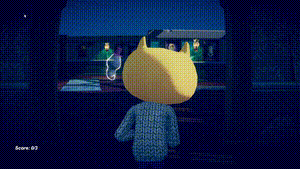

# John Lemon's Haunted Jaunt

Reference: Unity 3D tutorial [JohnLemon](https://learn.unity.com/project/john-lemon-s-haunted-jaunt-3d-beginner)

## How to play

John Lemon is put at one end of a haunting room. He needs your help to find the way out after collecting all three stars on the map. Remember not to be spotted by the ~~cute~~ walking ghosts and demon statues, or else you will lose the game!

(Game exits automatically after finishing)

* `1`, `2`, and `3` to switch viewports (`1` for third-person, `2` for first-person, and `3` for side-scrolling)
* Arrow key or `WSAD` to move, `SPACE` to jump
* `ESC` to exit

## Run the game

Just open the `.exe` file in `Build`, CS files are under `Assets/Scripts`

## Addictional contents

1. `SPACE` to jump
2. Added another two views (`1` and `2`). The camera will automatically adjust its distance to the character depending on occlusion.
3. Added a new winning condition: get all 3 stars.
